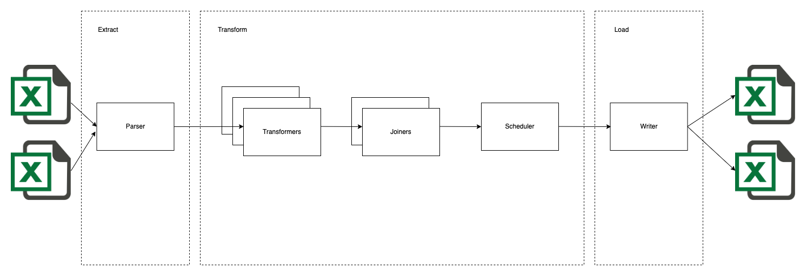

# Python Scheduler

 <!-- .element height="50%" width="50%" -->

### Running

This project was made using the [Poetry](https://python-poetry.org/docs/basic-usage/) dependency management tool.
As such, the poetry environment comes built with the dependencies required to run.

Follow the instructions on [poetry's website](https://python-poetry.org/docs/) to download the tool. At the time of
writing this requires Python 3.7+.

From the root directory, run the following command to start the scheduler task.

```
 poetry run python main.py                                              
```

## Testing

The project uses [pytest](https://docs.pytest.org/en/7.2.x/) for the test framework.
To run all tests, type the following command in the terminal:

```
poetry run pytest                               
```

## Walkthrough

### Entry point

`main.py` is the entry point for the project. This file orchestrates the Extract/Transform/Load areas of the
application.

### Parser

There is one parser file that takes in a filepath, reads the CSV if present and loads into
a [pandas](https://pandas.pydata.org/) dataframe.

### Formatters

Each filetype has its own formatter. Their job is to clean and format the data in a way that makes the processes later
on easier.
For instance, in [format_schedule](src/formatters/format_schedule.py), additional information is for shift start/end
times.
The schedule is extended to create employee (collectors) IDs for each employee working on a shift. Similarly, matches
have been extended to tasks where each task represents analysing on a specific team in a match.
The formatters are also responsible for relabeling columns in their respective dataframes.

### Joiners

Joiners are responsible for combining like-minded dataframes. For instance, a match is linked to a competition which in
turn has a corresponding priority as noted in the tasks instructions. Preferences have been hydrated with additional
information for competitions that don't have a preference squad. This is to aid in processing in the scheduler task.

### Schedule

## Notes

* The concept of an 'employee' is only with regards to a single shift. No employees span different shifts, which
  wouldn't happen in reality (ie) we create a new employee ID for each shift.
* An employees id is `employee-{squad}-{date}-{shift}-{employee number}`

#### Thoughts on code/best practices

* In [format_matches_to_tasks](src/formatters/format_matches.py) I would have liked to have checked/applied language
  decoding
  programatically across any series that needed it. However, in the interest of time applying to the `competition`
  seemed sensible given this dataset.

#### Assumptions

* A game can be processed by two collectors at the same time, one assessing the home team and another assessing the away
  team.
*

#### Issues with the algorithm

* Tasks are ordered by processing deadline. However, I've not taken into account whether deferring the processing of a
  match to another shift would make it quicker.
